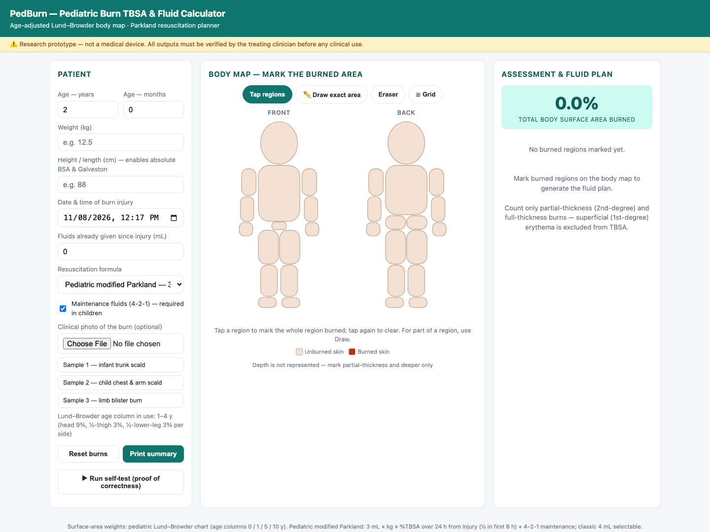
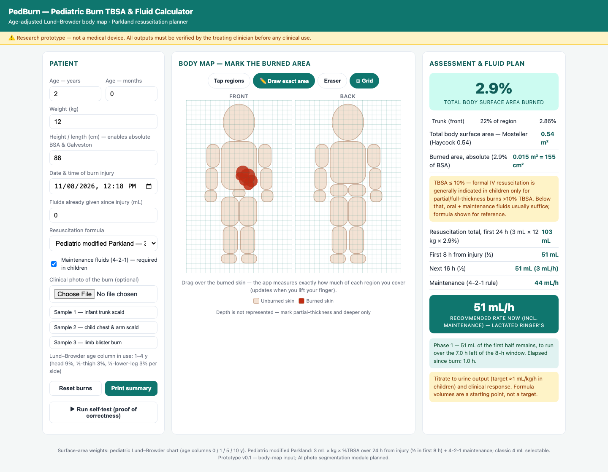
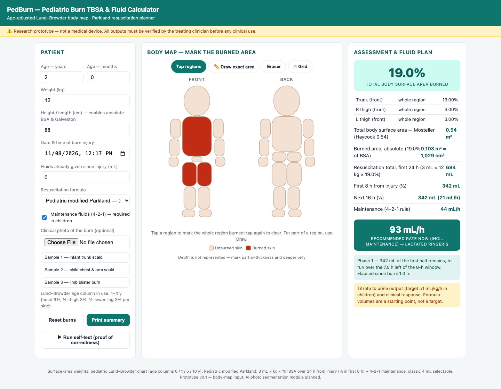
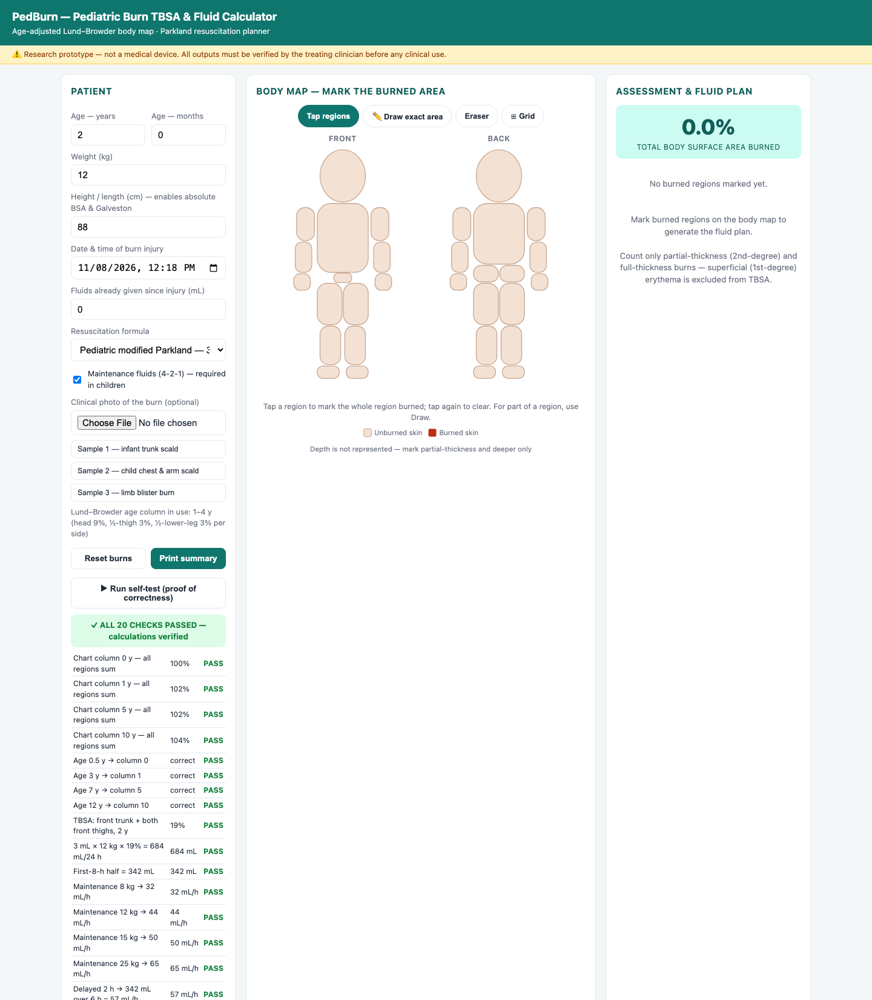

# PedBurn — Pediatric Burn TBSA & Fluid Resuscitation Calculator

### ▶ Live application: **https://pediatricsburncalculator.netlify.app/**

> **Research prototype — not a medical device.** All outputs must be verified by the treating clinician. Not for clinical use.

An age-aware, single-file web application that measures the percentage of Total Body Surface Area (TBSA) burned in a child and converts it into a complete fluid resuscitation plan — deterministically, reproducibly, and in under a minute at the bedside.

---

## 1 · The problem

Burns are among the most common unintentional injuries of childhood; the WHO attributes roughly **180,000 deaths per year** to burns worldwide, with children in low- and middle-income settings disproportionately affected. For any moderate-to-severe pediatric burn, the first clinical number that matters is **%TBSA burned**, because the entire first-day fluid prescription is proportional to it.

Estimating that number in children is uniquely error-prone, for three reasons:

1. **Anatomy changes with age.** An infant's head is ~20% of body surface; an adolescent's is ~9%. The legs grow in the opposite direction. Adult tools such as the Rule of Nines therefore systematically over- or under-estimate pediatric burns depending on burn location.
2. **Burns are irregular.** Charts force clinicians to eyeball what fraction of a body region an irregular patch covers — a step that is pure visual guesswork.
3. **Assessment is inter-rater dependent.** Published studies repeatedly find large disagreements between clinicians assessing the same burn, with referring centres commonly over-estimating TBSA by 50–100%. Because fluids scale linearly with TBSA, **every percentage point of estimation error becomes a fluid-prescription error** — under-resuscitation risks burn shock and kidney injury; over-resuscitation risks pulmonary oedema and compartment syndrome.

## 2 · The solution

PedBurn replaces visual guesswork with measurement at three levels of precision, all feeding one verified calculation engine:

| Level | How the burned area is captured | Precision |
|---|---|---|
| **Tap** | Tap a region to mark the whole region burned — binary, no grading | Coarse, fastest |
| **Draw** *(planimetry)* | Trace the actual irregular patch with a finger; the app counts covered pixels — thousands of tiny squares — against each region's true area | High, no rounding |
| **AI** *(in development)* | A segmentation network reads a clinical photograph, separates normal skin from burned skin, and pre-fills the same body map for the clinician to confirm | Highest, automatic |

The **Draw mode implements classical planimetry**: to measure an irregular area, overlay it with small squares and count them. Each figure is internally a grid of ~700,000 pixels; the burned fraction of a region is simply *painted squares ÷ total squares*. A visible grid overlay (⊞ button) demonstrates the method:

*Above: an irregular patch traced on the trunk covers 22% of that region → 2.86% TBSA — where marking whole regions would have forced a 13% trunk. Only the drawn skin is coloured; the region behind it is not tinted. With height entered, the app also reports the child's absolute body surface area (Mosteller/Haycock) and the burned area in cm².*

**Binary by design.** Skin is marked as either burned or not burned — one burn colour, no graded shading. A lighter tint would be read as a more superficial burn, and this map does not represent depth: the clinician judges depth and marks only partial-thickness (2nd-degree) and deeper. Partial involvement of a region is expressed by the *shape of the drawn area*, never by colour intensity.

## 3 · The approach

**Age-adjusted anatomy.** Every region of the front/back child figure carries a surface-area weight from a pediatric Lund–Browder chart with four age columns (<1, 1–4, 5–9, ≥10 years). Entering the age automatically selects the column — the same burn marks re-weight as the patient ages, with no mental arithmetic:

**Verified fluid engine.** TBSA feeds three selectable resuscitation formulas, always with pediatric safety rails:

- **Pediatric modified Parkland (default):** 3 mL × kg × %TBSA over 24 h — half in the first 8 h *counted from the time of burn, not arrival* — plus **mandatory Holliday–Segar 4-2-1 maintenance fluids**
- **Classic Parkland:** 4 mL × kg × %TBSA
- **Galveston (BSA-based):** 5000 mL/m² burned + 2000 mL/m² total BSA, using height + weight (Mosteller formula)
- Safety rails: >10% TBSA threshold for formal IV resuscitation, urine-output titration target ≈1 mL/kg/h, partial/full-thickness-only reminder, delayed-presentation catch-up logic that credits fluids already given and flags pacing as a clinician decision

**Trust through self-verification.** One button re-derives **20 hand-calculated values** inside the running app — chart column sums, age-band mapping, worked-example arithmetic, maintenance rates, BSA and Galveston math — and displays PASS/FAIL for each. Any failure turns the banner red with "do not use":

## 4 · Impact and expected numbers

- **Reproducibility:** identical inputs always produce identical TBSA and fluid plans — inter-rater variability at the calculation stage is eliminated by construction.
- **Error arithmetic:** in a 12 kg toddler, every 1% of TBSA mis-estimation changes the 24-hour prescription by 36 mL; a 2× overestimate (routinely reported at referral) would double a 684 mL prescription to 1,368 mL. Measuring instead of guessing removes exactly this class of error.
- **Speed:** a complete assessment — patient data, burn marking, fluid plan, printed summary — takes under a minute on a phone.
- **Validation targets (planned study):** absolute TBSA error < 5 percentage points versus expert-panel consensus; segmentation Dice coefficient > 0.85 for the Phase-3 AI; time-to-fluid-prescription reduced versus standard charting.

## 5 · Where this goes in the coming years

| Phase | Deliverable | Status |
|---|---|---|
| 1 | Age-adjusted Lund–Browder + multi-formula fluid engine | **Done** — self-test verified |
| 2 | Interactive body map: tap, draw-planimetry, grid, photo capture, print | **Done** — this repository |
| 3 | AI burn segmentation (U-Net encoder–decoder, cross-entropy + Dice loss) reading clinical photos with a fiducial ruler for absolute scale, pre-filling the body map | In development |
| 4 | Hospital dataset: ethics-approved, de-identified, surgeon-annotated pediatric burn photographs | Protocol in preparation |
| 5 | Clinical validation study vs. clinician estimates; emergency-department and telemedicine deployment | Planned |

The long-term vision: any emergency clinician — including in centres without burn specialists — photographs the patient, confirms an AI-proposed burn outline, and receives a reproducible, age-correct, auditable fluid prescription. The manual tap/draw workflow in this repository is both the fallback and the ground-truth interface the AI will be trained against.

## 6 · Using the app

**Live:** open **https://pediatricsburncalculator.netlify.app/** on any phone, tablet, or computer — nothing to install. On a phone it can be added to the home screen and used like a native app.

**Offline:** open **`index.html`** from a local copy. The entire application is one self-contained HTML file — **no build step, no dependencies, no server, no API keys, and no network calls of any kind.** All calculation and the draw-mode planimetry run locally in the browser, so patient data never leaves the device. The camera button attaches a clinical photo that is likewise stored on-device only.

> The Phase-3 AI segmentation model will also be designed to run on-device (or on a hospital-controlled inference server) rather than a third-party API, keeping patient images inside the institution.

Reproducible demo states for training and documentation: append `#demo=ex1` … `#demo=ex4` (worked examples), `#demo=ex5` (draw-mode planimetry), or `#demo=selftest` to the URL.

## 7 · Disclaimer

This software is provided for research and demonstration purposes only. It is not a registered medical device and must not be used to direct patient care. Clinical sample images used in local testing are excluded from this repository for copyright reasons; the app degrades gracefully without them.
